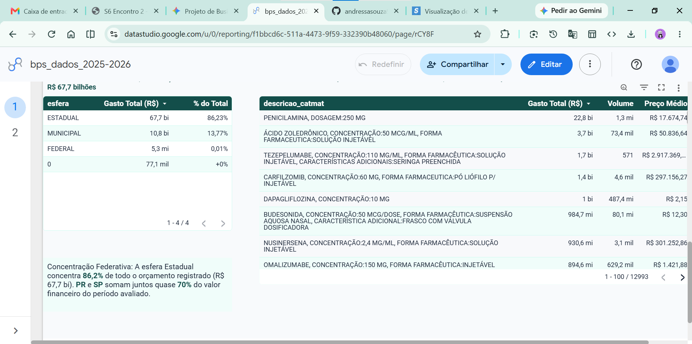
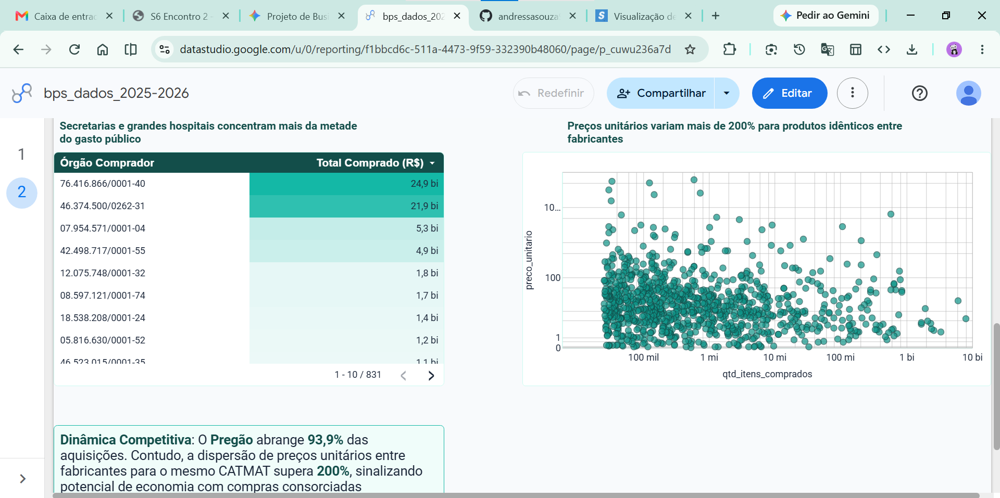

# # 📊 BPS Analytics: Gestão e Monitoramento de Gastos em Saúde (2020-2026)

Projeto de Inteligência de Negócios e Análise de Dados aplicado às compras públicas homologadas pelo **Banco de Preços em Saúde (BPS)**, cobrindo o período de 2020 a 2026.

---

## 🎯 Objetivo do Projeto

Desenvolver um ecossistema analítico integrado — composto por pipeline automatizado de Engenharia de Dados (ETL), modelagem estatística e painel interativo no Looker Studio — para monitorar, diagnosticar e dar transparência às aquisições públicas de medicamentos e insumos médico-hospitalares. O projeto visa:

- Identificar padrões históricos de gastos e volume físico adquirido.
- Mapear assimetrias regionais, federativas e institucionais na alocação de recursos.
- Avaliar a dinâmica competitiva, concentração de fornecedores e dispersão de preços unitários entre fabricantes.
- Fornecer subsídios técnicos para auditoria, controle social e tomada de decisão estratégica em compras públicas de saúde.

---

## 🏥 Contextualização do Problema

A gestão de suprimentos farmacêuticos e hospitalares no Brasil representa um dos maiores desafios orçamentários e operacionais do setor público. A descentralização das compras entre União, Estados e Municípios frequentemente acarreta:

1. **Dispersão Excessiva de Preços:** Entes públicos pagam valores substancialmente divergentes pelo mesmo medicamento e apresentação, decorrente de compras atomizadas e perda de poder de barganha.
2. **Dependência e Concentração de Mercado:** Oligopólios de distribuidoras e fabricantes globais em moléculas de alta complexidade elevam os riscos de desabastecimento e sobrepreço.
3. **Assimetria de Informação e Governança:** Dificuldade histórica de consolidar, sanear e confrontar microdados de compras distribuídas nacionalmente em tempo hábil para intervenções corretivas.

O BPS Analytics surge para sanar essa lacuna, transformando microdados transacionais em inteligência estratégica acessível e auditável.

---

## 🌐 Fonte dos Dados

Os microdados primários são provenientes do **Banco de Preços em Saúde (BPS)**, mantido pelo Ministério da Saúde do Brasil.

- **Origem:** Dados abertos de compras públicas homologadas (portal oficial do BPS / Dados.gov.br).
- **Recorte Temporal:** Exercícios de 2020, 2021, 2022, 2023, 2024, 2025 e 2026 (extração parcial).
- **Volume Bruto:** 342.716 registros transacionais distribuídos em 7 arquivos anuais em formato delimitado (CSV).

---

## 🛠️ Pipeline de ETL e Tratamento de Dados (Sprint 2)

O pipeline de extração, transformação e carga foi implementado em Python (`src/preparar_bps.py`) para unificar e sanear as bases de 2020 a 2026:

1. **Importação e Codificação:** Leitura sistemática das 7 bases anuais sob codificação `utf-8` e separador `;`, totalizando 342.716 registros brutos.
2. **Padronização de Esquema:** Normalização técnica de cabeçalhos (conversão para caixa baixa, eliminação de espaços, substituição de caracteres especiais e remoção de acentuação gráfica).
3. **Conversão de Tipos e Formatações:**
   - **Campos Monetários (`preco_total`, `preco_unitario`):** Higienização de strings com remoção de prefixos (`R$`) e pontos separadores de milhar, conversão da vírgula decimal para ponto e cast estrito para numérico de ponto flutuante (`float`).
   - **Quantidades (`qtd_itens_comprados`):** Higienização e conversão para formato numérico (`float`).
   - **Datas (`compra`, `insercao`):** Parsing e padronização para o formato ISO 8601 (`YYYY-MM-DD`).
4. **Tratamento de Nulos e Inconsistências:** Imputação controlada do rótulo categórico `'Não Informado'` em atributos de texto ausentes, evitando falhas de agrupamento.
5. **Deduplicação:** Identificação e expurgo de 19 registros estritamente duplicados na integridade da linha.
6. **Consolidação Final:** Preservação da rastreabilidade temporal (`ano_compra`) e exportação da base unificada `BPS_20_26_AndressaAlvesDeSouza.csv` contendo **342.697 linhas** e **25 colunas**.

---

## 📋 Descrição das Principais Colunas Utilizadas

| Coluna | Tipo de Dado | Descrição e Aplicação Analítica |
| :--- | :--- | :--- |
| `ano_compra` | Inteiro | Ano da homologação da compra (2020 a 2026). Utilizado na linha temporal e cortes anuais. |
| `compra` | Data (ISO) | Data exata da transação/empenho da compra pública. |
| `uf` | Texto | Unidade Federativa da instituição adquirente (27 UFs). Dimensão de análise geográfica. |
| `esfera` | Texto | Esfera administrativa compradora (`ESTADUAL`, `MUNICIPAL`, `FEDERAL`). |
| `cnpj_instituicao` | Texto | Cadastro Nacional da Pessoa Jurídica da entidade pública adquirente. |
| `nome_instituicao` | Texto | Razão social/nome do órgão comprador (quando preenchido). |
| `modalidade_compra` | Texto | Instrumento jurídico licitatório (Pregão, Dispensa, Inexigibilidade, etc.). |
| `cnpj_fornecedor` | Texto | CNPJ do distribuidor/fornecedor contratado para entrega do item. |
| `cnpj_fabricante` | Texto | CNPJ do laboratório/fabricante primário detentor do registro sanitário. |
| `codigo_br` | Inteiro/Texto | Código identificador padronizado no catálogo de materiais do SUS. |
| `descricao_catmat` | Texto | Descrição padronizada do princípio ativo, dosagem e forma farmacêutica (CATMAT). |
| `unidade_fornecimento` | Texto | Unidade de embalagem e fornecimento contratada (ex.: frasco, caixa, ampola). |
| `qtd_itens_comprados` | Numérico | Volume físico de unidades adquiridas no registro. |
| `preco_unitario` | Numérico | Valor unitário pago por item individual. |
| `preco_total` | Numérico | Valor financeiro total homologado da linha de compra (`qtd * preco_unitario`). |

---

## 📈 Métricas de Negócio e Gabarito Oficial de KPIs (Sprint 3)

Os cálculos foram consolidados via script de validação estatística em Python (`src/calcular_kpis_eda.py`) sobre os 342.697 registros unificados:

| Indicador (KPI) | Fórmula / Critério Metodológico | Valor Consolidado Oficial |
| :--- | :--- | :--- |
| **Total de Registros de Compra** | Contagem total de linhas da base tratada | **342.697** |
| **Valor Total Registrado** | Soma do campo `preco_total` | **R$ 78.557.477.974,09** |
| **Quantidade Total de Itens** | Soma do campo `qtd_itens_comprados` | **57.127.143.721 unidades** |
| **Instituições Compradoras Únicas** | Contagem distinta (`COUNT_DISTINCT`) de `cnpj_instituicao` | **831 entidades** |
| **Fornecedores Distintos** | Contagem distinta (`COUNT_DISTINCT`) de `cnpj_fornecedor` | **3.502 fornecedores** |
| **Preço Unitário Médio Ponderado** | `SUM(preco_total) / SUM(qtd_itens_comprados)` | **R$ 1,3751** |

### 📐 Modelagem e Regras de Agregação

- **Métricas Financeiras e Físicas:** Agregação estrita via `SUM` para `preco_total` e `qtd_itens_comprados`.
- **Rigor Metodológico de Preço:** Proibição estrita da soma direta ou média simples de `preco_unitario`. O indicador oficial de preço é mensurado pela **Média Ponderada pelo Volume**:
  $$ ext{Preço Médio Ponderado} = rac{\sum  ext{preco\_total}}{\sum  ext{qtd\_itens\_comprados}}$$
- **Contagem de Entidades:** Mensuradas exclusivamente via cardinalidade distinta (`COUNT_DISTINCT`) para órgãos e fornecedores.
- **Benchmark Comparativo de Preços:** Comparações válidas condicionadas à correspondência exata de `descricao_catmat` e `unidade_fornecimento`.
- *Documentação completa disponível em [`docs/modelagem_e_metricas.md`](docs/modelagem_e_metricas.md).*

---

## ❓ Mapeamento das 10 Perguntas de Negócio

| Nº | Pergunta de Negócio | Campos Necessários | Visual Construído no Dashboard | Resposta / Insight Sintetizado |
| :-: | :--- | :--- | :--- | :--- |
| **1** | Qual foi a evolução anual do valor total registrado nas compras em saúde? | `ano_compra`, `preco_total` | Gráfico de Linhas (Duplo Eixo c/ Volume) | Pico histórico acentuado em 2025 (R$ 34,93 bi), com normalização e cobertura parcial em 2026. |
| **2** | Quais Unidades Federativas (UF) concentram o maior montante financeiro? | `uf`, `preco_total` | Gráfico de Barras Horizontais | Liderança massiva de PR (R$ 29,18 bi) e SP (R$ 25,37 bi), que somam quase 70% nacional. |
| **3** | Quais instituições compradoras realizaram os maiores volumes de aquisição? | `cnpj_instituicao`, `preco_total` | Tabela Analítica com Barras | Top 10 órgãos concentram mais de 50% dos recursos, com liderança das Secretarias Estaduais. |
| **4** | Quais itens (`descricao_catmat`) representam o maior custo acumulado? | `descricao_catmat`, `preco_total` | Tabela Estratégica CATMAT | *Penicilamina 250 mg* (R$ 22,8 bi) e *Ácido Zoledrônico* lideram os desembolsos absolutos. |
| **5** | Qual o preço unitário médio ponderado de itens críticos ao longo dos anos? | `descricao_catmat`, `unidade_fornecimento`, `preco_total`, `qtd_itens_comprados` | Tabela / Linhas com Média Ponderada | O preço ponderado global da cesta SUS consolidou-se em R$ 1,38, variando conforme a classe terapêutica. |
| **6** | Qual é a distribuição das modalidades de compra empregadas pelos órgãos? | `modalidade_compra`, `preco_total` | Gráfico de Rosca | Predomínio hegemônico do **Pregão** (93,9%), seguido por Dispensas e Inexigibilidades pontuais. |
| **7** | Quais são os principais fornecedores por volume financeiro homologado? | `cnpj_fornecedor`, `preco_total` | Gráfico de Barras Horizontais | Elevada concentração: os 10 maiores distribuidores movimentam dezenas de bilhões de reais. |
| **8** | Como se dividem as compras entre as diferentes esferas governamentais? | `esfera`, `preco_total` | Tabela Dinâmica com % do Total | Esfera **Estadual** concentra **86,23%** (R$ 67,7 bi), Municipal **13,77%** e Federal residual (0,01%). |
| **9** | Há variação expressiva de preços entre diferentes fabricantes para o mesmo produto? | `descricao_catmat`, `cnpj_fabricante`, `preco_unitario` | Gráfico de Dispersão (Escala Log) | Dispersão superior a 200% em moléculas idênticas entre diferentes laboratórios homologados. |
| **10** | Qual o volume total de itens hospitalares e medicamentos adquiridos por ano? | `ano_compra`, `qtd_itens_comprados` | Eixo Secundário do Gráfico Temporal | 57,12 bilhões de unidades físicas acumuladas, com picos associados a insumos de consumo básico. |

---

## 📊 Dashboard Interativo no Looker Studio (Sprint 4)

O painel foi construído no Google Looker Studio seguindo diretrizes executivas de Usabilidade, Experiência do Usuário (UX) e Storytelling de Dados.

🔗 **Link de Acesso Direto:** [Acessar Dashboard no Looker Studio](https://datastudio.google.com/reporting/f1bbcd6c-511a-4473-9f59-332390b48060)

- 🎥 **Vídeo de Apresentação (Máx. 5 min):** [Assistir ao Vídeo no Google Drive](https://drive.google.com/file/d/1YKBxUPO4VNwha2uoiSmglqEqszzqKtZp/view?usp=sharing)

### Estrutura Visual em Duas Páginas

#### Página 1: Visão Estratégica e Panorama Macro

- **Barra Superior:** Controles de filtros dinâmicos (`ano_compra`, `uf`, `esfera`, `descricao_catmat`).
- **Cartões de KPIs:** *Gasto Total*, *Quantidade de Itens*, *Registros Totais*, *Instituições*, *Fornecedores* e *Preço Médio Ponderado*.
- **Gráfico Temporal:** Linhas com eixo duplo correlacionando Gasto Total (R$) vs. Volume Físico.
- **Distribuição Federativa:** Barras ordenadas por volume orçamentário por Unidade Federativa.
- **Estrutura Federativa:** Tabela analítica detalhando Gasto e % de Representatividade por Esfera.
- **Detalhamento CATMAT:** Tabela dinâmica dos Top Medicamentos e Insumos por Gasto Total.



#### Página 2: Operacional, Fornecedores e Modalidades

- **Top Fornecedores Homologados:** Ranking em barras dos maiores distribuidores por CNPJ.
- **Modalidades de Contratação:** Gráfico de rosca evidenciando a hegemonia do Pregão vs. contratações diretas.
- **Maiores Instituições Compradoras:** Tabela com barras de volume financeiro alocado pelos órgãos.
- **Dinâmica de Fabricantes & Dispersão:** Gráfico de dispersão em escala logarítmica correlacionando Volume Adquirido vs. Preço Unitário Médio por fabricante, expondo assimetrias de mercado.



## 🔍 Principais Análises e Descobertas (Sprint 5)

1. **Hiperconcentração na Esfera Estadual (86,23%):** Ao contrário do esperado na atenção básica municipalizada, a alocação financeira no BPS é massivamente estadual (R$ 67,7 bi). Isso decorre da centralização do Componente Especializado da Assistência Farmacêutica (medicamentos de alto custo e judicialização) nas Secretarias Estaduais de Saúde.
2. **Pico Orçamentário Singular em 2025:** O exercício de 2025 atingiu **R$ 34,93 bilhões** (44,5% de todo o período histórico avaliado) em apenas 26.214 registros, denunciando contratações públicas de altíssimo valor unitário consolidado.
3. **Polo Econômico Sul-Sudeste:** As UFs do Paraná (R$ 29,18 bi; 37,14%) e São Paulo (R$ 25,37 bi; 32,30%) concentram sozinhas **69,44%** de todos os gastos da base, decorrente de sua densidade hospitalar, redes universitárias e maturidade de alimentação tempestiva do sistema.
4. **Hegemonia do Pregão Eletrônico (93,9%):** Consolidação da modalidade competitiva prevista em lei como padrão quase absoluto no setor da saúde pública, relegando Dispensas e Inexigibilidades a casos de emergência sanitária e patentes exclusivas.
5. **Divergência Crítica de Preços entre Fabricantes:** A dispersão identificou variações superiores a 200% no preço unitário cobrado por diferentes laboratórios para a mesma especificação técnica e concentração química (CATMAT), indicando assimetria nas negociações locais.

---

## 💡 Recomendações Baseadas nos Dados

1. **Expansão de Consórcios Públicos e Atas de Registro de Preços Compartilhadas:** Unificar as demandas de municípios e estados para itens de alto volume e custo moderado, reduzindo a dispersão de preços unitários identificada na análise.
2. **Gestão Estratégica e Matriz de Risco de Fornecedores:** Implementar monitoramento contínuo de capacidade operacional e conformidade sobre os 10 maiores distribuidores e fabricantes, mitigando vulnerabilidades de desabastecimento em itens críticos (como *Penicilamina* e *Ácido Zoledrônico*).
3. **Auditoria de Conformidade nos Pregões:** Instituir ferramentas de inteligência para parametrização automática de preços de referência nos editais de pregão, alertando gestores quando cotações unitárias superarem o percentil 75 da série histórica.
4. **Governança e Qualificação de Cadastro:** Exigir validação de integridade cadastral nos sistemas geradores de empenho hospitalar, erradicando registros sem preenchimento de esfera ou com identificadores ausentes.

---

## ⚠️ Limitações Identificadas na Base e na Análise

1. **Omissão de Nomes Textuais de Entidades:** A base consolidada disponibiliza apenas as chaves numéricas de identificação (`cnpj_instituicao`, `cnpj_fornecedor`, `cnpj_fabricante`), demandando cruzamento relacional externo com o cadastro da Receita Federal para enriquecimento das razões sociais.
2. **Registros Residuais Nulos:** Presença de transações residuais com classificação federativa zerada (`esfera = 0`), devidamente isoladas nas análises de proporção governamental.
3. **Alimentação Descentralizada e Janela Móvel:** Como o BPS depende da remessa operacional das informações pelos entes conveniados, o ano corrente de 2026 e anos de transição podem apresentar defasagem temporal de inserção nas compras municipais.

---

## 🚀 Instruções para Reprodução do Projeto

### 1. Pré-requisitos

- Python 3.10 ou superior instalado.
- Visual Studio Code ou IDE de sua preferência.
- Acesso ao Google Drive / Looker Studio com conta Google ativa.

### 2. Estrutura de Diretórios Recomendada

```text
bps-dados-saude-bi/
├── dashboard/
│   ├── link_dashboard.txt             # Link oficial do painel Looker Studio
│   └── imagens_dashboard/             # Capturas de tela do painel
│       ├── dashboard_pagina_1/
│       │   ├── dashboard_imagem_01.1.png
│       │   ├── dashboard_imagem_01.2.png
│       │   └── dashboard_imagem_01.3.png
│       └── dashboard_pagina_2/
│           ├── dashboard_imagem_02.1.png
│           ├── dashboard_imagem_02.2.png
│           └── dashboard_imagem_02.3.png
├── data/
│   ├── processed/
│   │   ├── BPS_20_26_AndressaAlvesDeSouza.csv  # Base tratada oficial homologada
│   │   └── bps_consolidado.parquet             # Arquivo colunar otimizado
│   └── raw/                           # Microdados anuais brutos do BPS (2020 a 2026)
│       ├── bps_2020.csv
│       ├── bps_2021.csv
│       ├── bps_2022.csv
│       ├── bps_2023.csv
│       ├── bps_2024.csv
│       ├── bps_2025.csv
│       └── bps_2026.csv
├── docs/
│   ├── dicionario_de_dados.md         # Mapeamento técnico e tipos de dados
│   ├── guia_looker_studio.md          # Guia de construção e métricas no Looker
│   ├── modelagem_e_metricas.md        # Documentação estatística dos KPIs
│   └── relatorio_qualidade_dados.md   # Relatório de auditoria e saneamento
├── notebooks/
│   └── notebook_bps_analise.ipynb     # Notebook Jupyter com fluxo completo (Sprints 1 a 6)
├── src/
│   ├── calcular_kpis_eda.py           # Validação estatística e apuração dos KPIs
│   ├── carregar_bigquery.py           # Pipeline opcional de carga no BigQuery
│   ├── inspecionar_colunas.py         # Auditoria de delimitadores e codificações
│   └── preparar_bps.py                # Pipeline ETL de limpeza e unificação
├── video/
│   └── link_video.txt                 # Link público da gravação da apresentação
├── .gitignore
├── README.md
└── requirements.txt
```

### 3. Instalação e Execução do Pipeline

Clone o repositório ou configure a pasta no seu terminal:

```bash
# 1. Crie e ative um ambiente virtual
python -m venv venv
source venv/bin/activate  # No Windows: venv\Scriptsctivate

# 2. Instale as dependências analíticas
pip install pandas numpy

# 3. Execute o pipeline de ETL
python src/preparar_bps.py

# 4. Execute o script de cálculo e conferência de KPIs
python src/calcular_kpis_eda.py
```

### 4. Conexão no Looker Studio

1. Acesse o [Google Looker Studio](https://datastudio.google.com/)
2. Crie uma nova fonte de dados apontando para o arquivo consolidado gerado (`BPS_20_26_AndressaAlvesDeSouza.csv`) no seu Google Drive.
3. Certifique-se de que os tipos de campos estão mapeados corretamente (Moeda brasileira para `preco_total` e `preco_unitario`; Texto para os campos de CNPJ e data para `compra`).
4. Reproduza os visuais e filtros conforme o gabarito estruturado neste repositório.

5. Execução Local do Pipeline
Para reproduzir os resultados e gerar a base tratada localmente:

Bash

# 1. Clone o repositório

git clone [https://github.com/andressasouza98/bps-dados-saude-bi.git](https://github.com/andressasouza98/bps-dados-saude-bi.git)
cd bps-dados-saude-bi

# 2. Crie e ative o ambiente virtual

# No Windows

python -m venv venv
.\venv\Scripts\activate

# No Linux / macOS

python3 -m venv venv
source venv/bin/activate

# 3. Instale as dependências analíticas

pip install -r requirements.txt

# 4. Execute a rotina de inspeção, ETL e apuração de KPIs

python src/inspecionar_colunas.py
python src/preparar_bps.py
python src/calcular_kpis_eda.py
